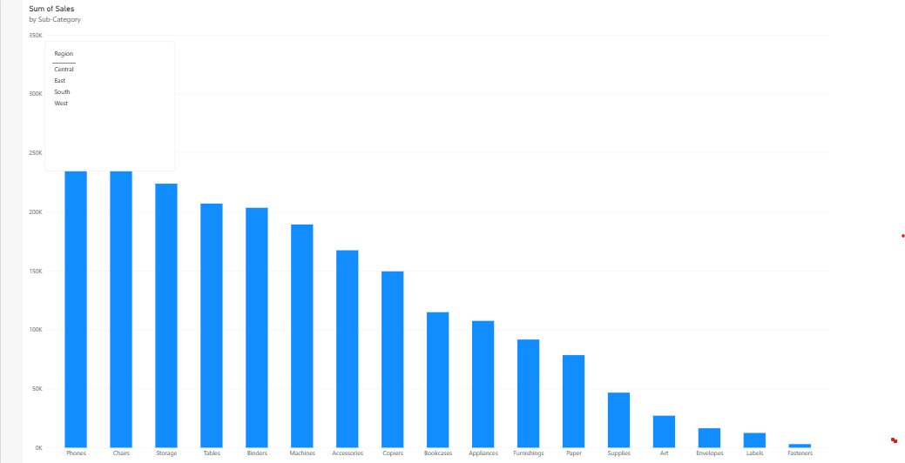
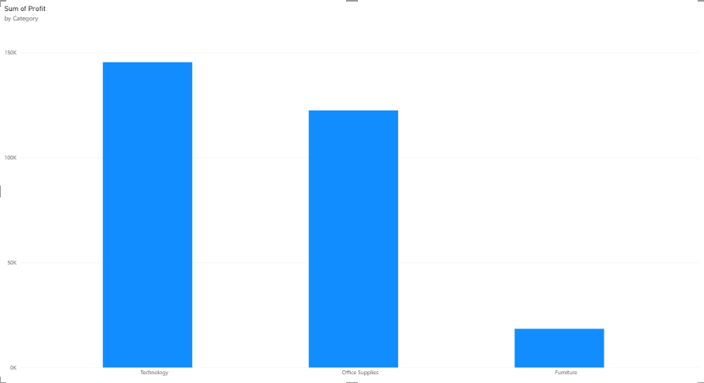
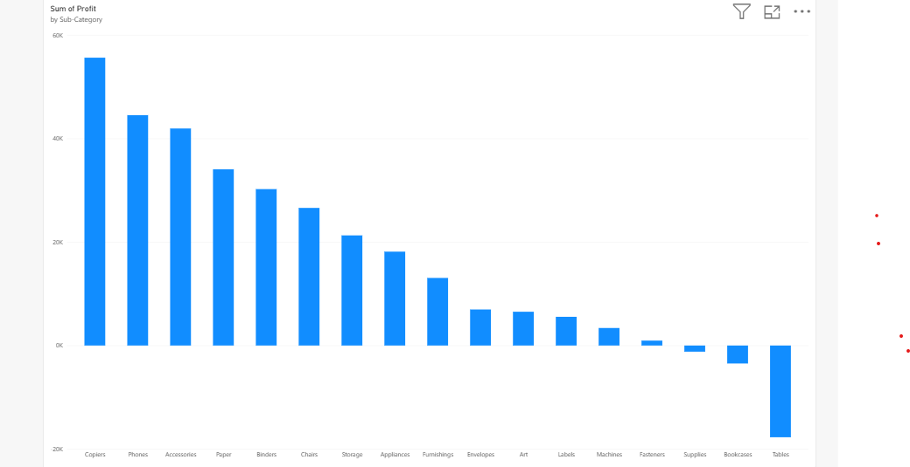

# Retail Sales & Profitability Analysis Dashboard

## Problem Statement
Analyzed retail sales data to identify regional sales performance, category-level profitability, and the impact of discounting on profit margins — helping uncover where the business is winning and where it's leaking money.

## Data Source
Kaggle "Sample Superstore Dataset" — ~10,000 orders with fields for region, category, sub-category, sales, discount, and profit.

## Approach
1. Loaded the dataset into SQLite and wrote SQL queries to answer key business questions
2. Built an interactive Power BI dashboard to visualize the findings
3. Documented insights below

## Key Findings
- **West region generates the highest sales** (₹7.25L) — 26% more than the lowest-performing South region (₹3.91L)
- **Technology is the most profitable category** (₹1.45L), while Furniture lags far behind (₹18.4K)
- **Tables and Bookcases are actual loss-makers**, posting negative profit (-₹17.7K and -₹3.5K respectively) despite healthy sales volume
- **Discounts above 20% turn average profit negative** — orders with no discount average ₹66.90 profit, while medium/high discount bands average a loss

## Dashboard

## Tools Used
SQL (SQLite), Power BI Desktop

## What I'd Do Next
Investigate why Tables and Bookcases lose money — likely linked to over-discounting — and recommend capping discounts near 20% to protect margins.
